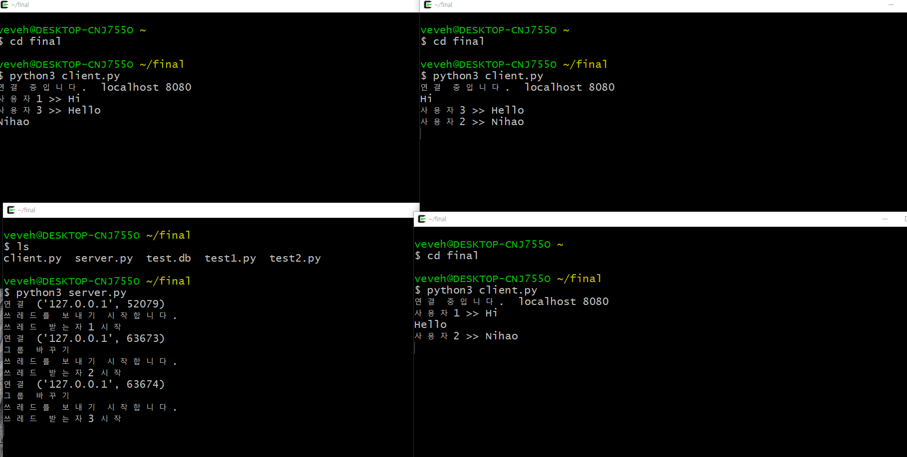
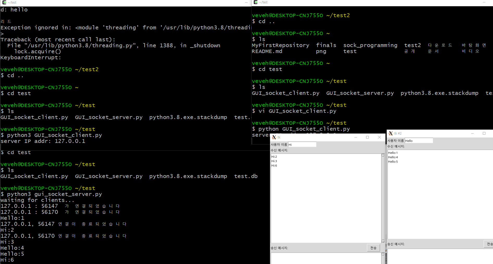
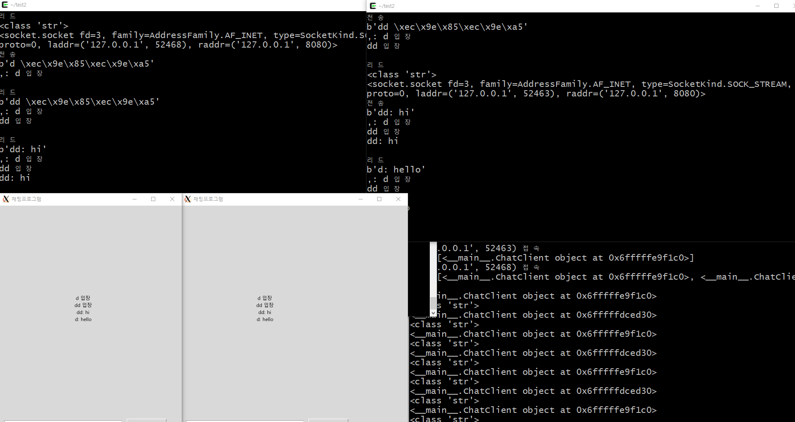

#201744065 이항주
# TCP-IP-FINAL 프로그램 개발 보고서
## 개요, 목적, 설계 및 기능, 차이점등, 실행화면 이미지
- ## 개요
*멀티 쓰레드를 이용한 다중 접속 채팅프로그램입니다. 이는 데이터베이스를 이용하여 참여하는 사용자 1~ n의 이름을 저장하여 로그를 남기는 채팅 프로그램을 만드려했습니다. 이것 저것 교수님의 코드에도 DB를 추가하여 수정해보고 인터넷에서 참고한 채팅프로그램과 제가 만든 채팅프로그램 총 세 가지에 추가 변경한 결과 아래와 같은 세 가지의 결과가 나왔습니다.*
- ## 목적
*개요와 마찬가지인 채팅을 하기 위한 프로그램입니다 . 세 가지 모두 멀티 쓰레드를 이용한 다중 접속 채팅프로그램이고 두 가지는 GUI가 활용된 프로그램이며 한 가지는 콘솔창으로 데이터베이스를 연동시키는 프로그램입니다.*
- ## 설계 및 기능
*chat_server.c 와 chat_client.c 두 파일로 구성되어있고 이름에서도 알 수 있지만 
server.c는 서버의 역할을 하고 client.c 를 통해 접속하는 방식입니다. 서버는 클라이언트의 모든 메시지를 받아 각 클라이언트에게 동일한 메시지를 전달해주어야 하며 클라이언트는 언제든 채팅서버에 접속하여 메시지를 타 클라이언트와 소통할 수 있어야합니다.*
- ## 차이점
*원래는 sqllite를 사용하고 그래픽 인터페이스를 활용하여 들어가기 버튼을 누르면 채팅이 실행 돼 로그인 되고 아이디가 저장되는 형식을 만드려고 했었습니다. 하지만 final 프로그램은 너무나 많은 오류로 인해 데이터 베이스를 만드는 것까지 밖에 못했으며 인터페이스는 구현하지 못하였습니다.
우선 sqlite3을 활용하는 데이터베이스 연동을 하기 위해 set-up에서 python 모든 파일을 다운 받았으며 인터페이스를 구현하기 위해서도 모든  tkinter를 다운 받아 파이썬 수업때 배웠던 그래픽 인터페이스 예제들을 구현하여 실행해보았습니다. 하지만 tk.Tk() 부분에서 계속 오류가 나와 인터페이스는 결국 구현하지 못하게 됐고 데이터 베이스 역시 db 생성까지만 되고 그 이후 연동은 수많은 오류로 구현하지 못하였습니다. 도커 부분은 현재 python, centos 등 총 3기가 정도 이미지로 받아와 각각 활용도 있게 쓰려하는데.. 어떻게 도커를 사용할지 몰라 고전하고 있습니다. 이에 최종적으론 채팅 구현만을 했으며 나머지 부분을 보완할 예정입니다.*
- ## 실행화면 이미지
## 첫번째.콘솔 final 다중 접속 채팅 프로그램
</img>

## 두번째. 교수님 코드를 활용한 DB 추가 채팅 출력 프로그램
</img>

## 세번째, GUI와 DB를 추가시킨 다중 접속 채팅 프로그램
</img>
